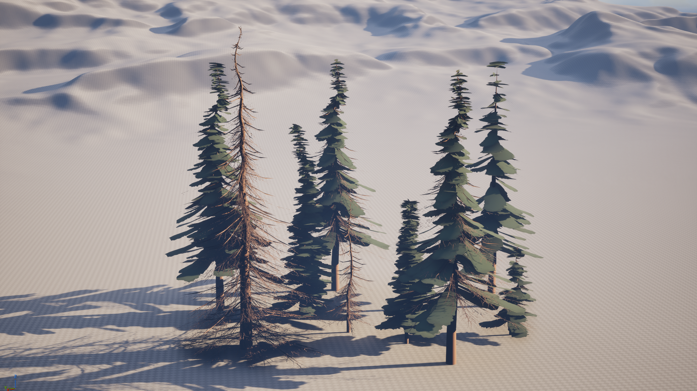
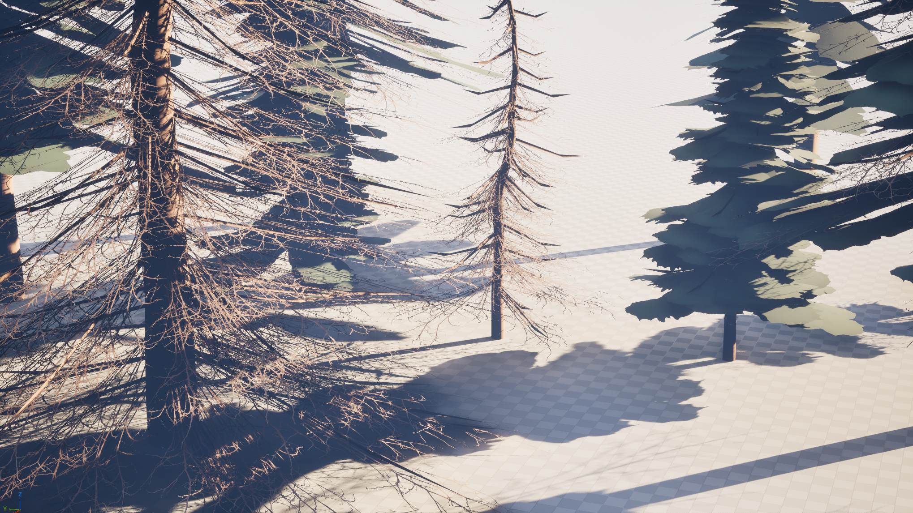

MI 337 Project 1

-------------------
This tool allows you to procedurally generate pine trees with leaf cards of alive or dead branches and many other adjustable features like height, branch thickness and density, etc.
-------------------

How to use:
-------------------
**Height** is the overall height of the tree.

**Initial Resolution** is the resampling of the initial curve for the initial deforming.

**Initial Noise Scale** is how much the initial trunk is deformed.

**Initial Noise Over Distance** is a ratio of how much the factor will play into how much the noise can affect the tree.

**W** is the random seed for everything.

**First Branch Density** is how many branches appear on the tree, dead or alive.

**First Branch Length** is how long the longest of those branches will be.

**Branch Start Height** is the minimum height of the tree for branches to start spawning.

**Trunk Thickness** is the radius of the trunk's thickness at the base.

**Thick Branch Chance** is the chance for each leaf card to also generate an actual geometry branch.

**Min** and **Max** are used to decide whether the branches will be dead or alive. The lower the **Min**, the more branches will be dead, and the higher the **Max**, the more branches will be alive.

**Trunk Resolution** is the resolution of the trunk, and **Branch Resolution** is the resolution of the branch. Both of those are a round resolution.

Screenshots:
-------------------
Generated trees in Blender:

The same trees in Unreal:

Write Up:
-------------------
This project went a lot smoother then I first thought it would, once I was in the nodes I kind of got into a groove. I didnt need to look back at tutorials at all except for the section on creating UVs. I had a bit of difficulty with understanding where factors were being pulled from in specific instances, but after messing with the inputs enough I figured it out. I think that my final version isnt super performant, but I did eliminate the quad overdraw by using alpha clipping with masks instead of blending, I also need to find a better card for a living branch as I just brought the texture into photopea and made it super quickly myself.